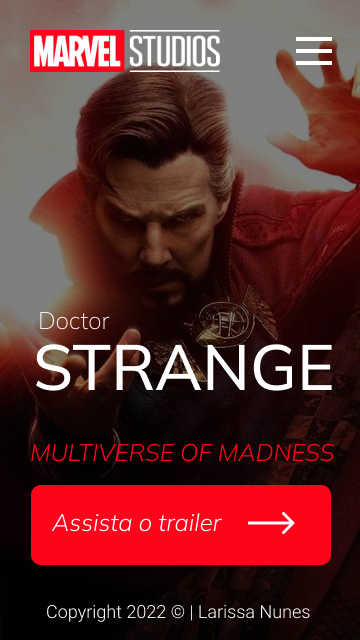

# Doctor Strange

Projeto construído durante as aulas de LIMA, no curso desenvolvimento de sistemas do [SENAI Jandira](https://jandira.senai.sp.br) 

## Qual era o objetivo do projeto?
O projeto era criar uma Landing Page com design feito no figma.

---

## O que é uma Landing Page?
Landing Pages são páginas com foco principal na conversão de visitantes, assim essas páginas possuem uma estética mais minimalista comparada com sites tradicionais.

---

## Tecnologias usadas
- HTML 5
- CSS 3
- Javascript
- Figma

---

## Links

 - [Resultado](https://llanunes.github.io/doctor-strange/)
 - [Projeto no Figma](https://www.figma.com/file/Jcu2cGfWPLq1xG3h11VKAZ/Untitled?node-id=1%3A47)
 - [Código](https://github.com/llanunes/doctor-strange)

 ## Autor

 [Larissa Nunes](https://github.com/llanunes)

